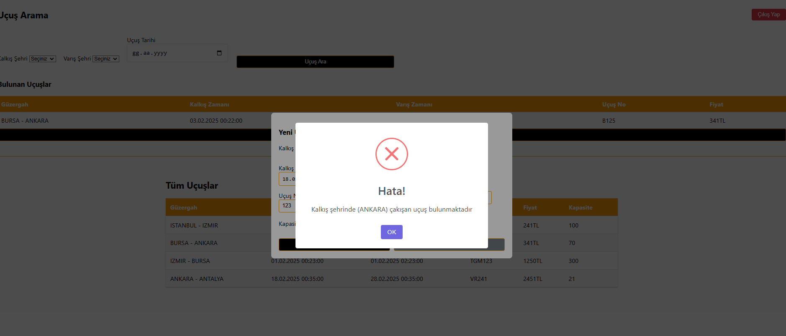

# Odeon Airlines Frontend Documentation

## Overview
Odeon Airlines frontend uygulaması, React kullanılarak geliştirilmiş bir uçuş yönetim sistemidir. Kullanıcılar uçuş arama, rezervasyon ve yönetim işlemlerini gerçekleştirebilir.
Detaylar için ODEON-CASE-STUDY pdf dosyası incelenebilir.

Backend projesi: https://github.com/Mduzgunn/odeon-airlines

## Tech Stack
- React 19.0.0
- React Router Dom 6.28.2
- Axios 1.7.9
- SweetAlert2
- CSS3

## Images

**login page**

**user page**

**admin page**

**admin add flight page**

**error message example**

## Features
### User Authentication
- Kullanıcı Girişi
- Kullanıcı Kaydı
- JWT Token Yönetimi

### Flight Management
- Uçuş Arama
  - Kalkış Şehri
  - Varış Şehri
  - Tarih Seçimi
- Uçuş Listeleme
- Uçuş Ekleme (Admin)

## Component Structure
### Base Components
- **Button**: Özelleştirilmiş buton komponenti
- **Select**: Özelleştirilmiş Form select komponenti
- **DatePicker**: Özelleştirilmiş Tarih seçici komponenti
- **Input**: Özelleştirilmiş Form input komponenti

### Feature Components
- **Login**: Kullanıcı giriş formu
- **Register**: Kullanıcı kayıt formu
- **FlightSearch**: Uçuş arama formu
- **FlightList**: Uçuş listeleme komponenti (Admin)
- **AddFlight**: Uçuş ekleme formu (Admin)

## Form Validation
- Tüm form alanları için zorunlu alan kontrolü
- Tarih formatı kontrolü
- Şehir seçimi kontrolü

## State Management
- Local state yönetimi için React Hooks
- Authentication state için local storage

## API Integration
- Backend ile iletişim için Axios kullanılmaktadır.

## Error Handling
- Form validasyon hataları
- API hata mesajları
- Kullanıcı dostu hata bildirimleri (SweetAlert2)

